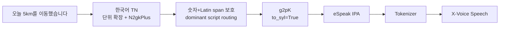
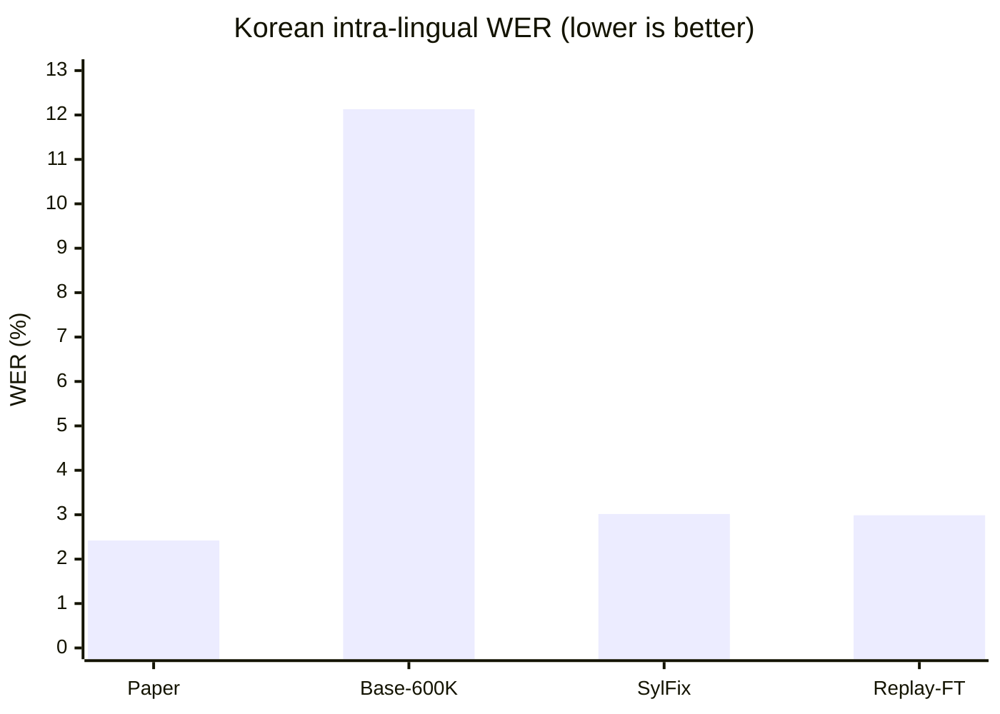

# X-Voice 한국어 Voice Cloning 개선 연구

<p align="center">
  
</p>

> 2026 하계 연구연수 최종 정리 · 연구 기간: 2026.07.01–2026.08.31

이 저장소는 [X-Voice](https://github.com/sunnyxrxrx/X-Voice)를 기반으로 한국어 zero-shot cross-lingual voice cloning의 **발음 정확도와 발화 안정성**, **한·영 code-switching 처리**를 개선한 연구 결과입니다. 공개 checkpoint의 한국어 성능을 재현하고, 데이터·학습·평가 파이프라인을 구축한 뒤, 오류 원인을 `g2pK → eSpeak → IPA tokenizer`와 language routing에서 찾아 코드로 수정했습니다.

- **Survey**: voice cloning 기술, 평가 지표, 한국어 음성 데이터셋 11종 조사
- **Research & Implementation**: 데이터 정제, fine-tuning, 평가 재현, 한국어 음절·숫자·단위·한영 혼합 처리 개선


## 1. 연구 배경과 목표

X-Voice는 flow matching 기반 다국어 TTS로, 짧은 reference audio만으로 별도 화자 학습 없이 30개 언어의 음성을 생성합니다. 하지만 공개 Stage 1 600K checkpoint를 한국어·영어·중국어에 적용했을 때 다음 문제가 관찰됐습니다.

- 한국어 음소가 부자연스럽거나 일부 발화가 길게 늘어남
- 숫자와 조수사(예: `3명`)가 문맥에 맞지 않게 읽힘
- 영문 단위(예: `5km`)의 발음이 문장 내 위치에 따라 달라짐
- 한·영 code-switching에서 숫자·영문·한글 span 분리로 자연스러움 저하
- 공개 checkpoint/evaluation code의 한국어 WER가 논문 보고값과 크게 다름

연구 목표는 다음과 같습니다.

1. AI Hub 한국어 음성으로 X-Voice의 한국어 적응 성능을 높인다.
2. 한국어 단독 학습의 language bias와 catastrophic forgetting을 multilingual replay로 완화한다.
3. WER·SIM-o 중심 평가 파이프라인을 구축해 결과를 재현한다.
4. 한국어 G2P/IPA 변환과 숫자·단위 routing 오류를 코드 수준에서 진단·수정한다.
5. 원본과 개선 구현을 함께 보존해 변경 효과를 비교 가능하게 한다.

## 2. Survey

### 2.1 Voice cloning 및 평가 지표

Voice cloning은 TTS가 텍스트 내용뿐 아니라 특정 화자의 음색과 발화 특성까지 재현하도록 확장된 기술입니다.

| 방식 | 입력/학습 방식 | 특징 |
|---|---|---|
| Speaker adaptation | 대상 화자 데이터로 fine-tuning | 화자마다 별도 학습 필요 |
| Few-shot cloning | 소량의 대상 화자 음성으로 적응 | 적은 데이터지만 화자별 학습 필요 |
| Zero-shot cloning | 짧은 reference audio를 조건으로 즉시 생성 | 미등록 화자도 별도 학습 불필요 |
| Cross-lingual cloning | reference와 다른 언어의 target text 생성 | 화자 정체성을 유지하며 언어 전환 |

일반 TTS의 `Text analysis → Acoustic model → Vocoder` 중 이 연구는 normalization, language routing, G2P와 IPA tokenization에 집중했습니다. 평가는 한 지표가 아닌 다음 지표를 함께 검토했습니다.

| 평가 대상 | 지표 | 의미 |
|---|---|---|
| 발음/내용 정확도 | WER, CER ↓ | ASR 전사와 target text의 오류율 |
| 화자 유사도 | SIM-o/SECS ↑ | reference와 생성 음성 embedding의 cosine similarity |
| 자연스러움 | MOS ↑ | 청취자의 1–5점 평균 |
| 음질 | DNSMOS ↑ | 비침습 음질 예측 점수 |
| 운율 | FFE ↓ | pitch/voicing 오류 구간 비율 |
| 생성 속도 | RTF ↓ | 생성 시간 ÷ 음성 길이 |

본 실험의 정량 비교는 공개 benchmark와 맞추기 위해 **WER와 SIM-o**를 중심으로 수행했습니다.

### 2.2 한국어 음성 데이터셋 11종 조사

낭독/자연발화, 화자 다양성, 숫자·외래어·code-switching, 방언과 라벨 구조가 다른 데이터셋을 조사했습니다.

| 데이터셋 | 발화 형태 | 핵심 특징 | 활용 관점 |
|---|---|---|---|
| AI Hub 다화자 음성합성 | 단문 낭독 | 10,152 h, 3,495명, WAV–전사 pair | 대규모 한국어 fine-tuning 주 데이터 |
| AI Hub 감성·발화 스타일 | 감정·스타일 낭독 | 7개 감정과 5개 발화 스타일 | 억양·감정·운율 확장 |
| KSS | 단일 화자 낭독 | 원문·확장문·자모 분해문 | normalization 비교 |
| Deeply Korean Read Speech | 2인 낭독 | 감성, 기기·거리·장소 라벨 | 환경 강건성 |
| Zeroth Korean | 다화자 낭독 | 긴 문어체, 발음사전·언어모델 | ASR/장문 평가 |
| KsponSpeech | 2인 자유대화 | 간투사·반복·수정·말 끊김 | 자연발화 확장 |
| AI Hub 숫자 패턴 발화 | 문맥형 숫자 낭독 | ITN/TN pair, 날짜·금액·주소·비율 | 숫자·조수사 TN |
| AI Hub 한국인 외래어 발화 | 단어·짧은 문장 | 외래어·고유명사의 한국식 발음 | 외래어 분석 |
| AI Hub 한영 혼합 인식 | 2인 대화 | 한국어 전사와 영어 `originalForm` | code-switching |
| AI Hub 중·노년층 방언 | 낭독+자유발화+대화 | 강원·경상 방언, 표준어 대응 | 지역·연령 다양성 |
| Seoul Corpus | 인터뷰 자연발화 | 철자·실제 발음·음소 TextGrid | 음성학 분석 |

이번 학습에는 깨끗한 다화자 음성과 충분한 발화 수를 갖춘 **AI Hub 다화자 음성합성 데이터**를 우선 사용했습니다. 숫자 패턴, 한영 혼합, 외래어 데이터는 후속 학습과 전용 평가셋에 특히 적합합니다.

## 3. Research & Implementation

### 3.1 데이터 전처리

1. WAV–JSON 전사를 연결해 `file_path | duration | text` metadata 생성
2. 0.5–30초 발화만 유지
3. DNSMOS 1.5 미만 저품질 음성 제거
4. 동일 전사문이 20회를 초과해 반복되는 샘플 제거
5. 문자 수/음성 길이로 발화 속도를 계산하고 IQR 이상치 제거
6. 한국어 전사문을 IPA로 변환
7. `raw.arrow`, `vocab.txt`, `vocab_stats.txt`, `duration.json` 생성

원본 데이터 전체는 10,152시간/3,495명이지만 실험에는 정제·샘플링한 subset을 사용했습니다. 원천 데이터와 checkpoint는 라이선스·용량 문제로 포함하지 않습니다.

### 3.2 Experiment 1 — Korean-only fine-tuning

- 초기 모델: X-Voice Stage 1 600K
- 학습 데이터: AI Hub 다화자 한국어 500 h
- epoch 1, learning rate `7.5e-5`

한국어 성능은 개선됐으나 모델 표현이 한국어에 편향되고 multilingual 능력 일부가 저하되는 catastrophic forgetting이 관찰됐습니다.

### 3.3 Experiment 2 — Multilingual data replay

한국어 적응과 원래의 다국어 능력을 함께 보존하도록 총 1,100 h replay를 구성했습니다.

| 구성 | 시간 |
|---|---:|
| AI Hub 한국어 | 500 h |
| 영어 | 100 h |
| 한국어·중국어·일본어 | 각 50 h |
| 독·불·서·이·포·러 | 각 25 h |
| 나머지 지원 언어 | 각 25 h |

초기 모델은 Stage 1 600K, epoch는 1, learning rate는 `5e-6`입니다. 설정은 [`XVoice_KO_Replay_Stage1.yaml`](src/x_voice/configs/XVoice_KO_Replay_Stage1.yaml), 음절 보정 재학습은 [`XVoice_KO_Replay_SylFix_Stage1.yaml`](src/x_voice/configs/XVoice_KO_Replay_SylFix_Stage1.yaml), 한·영 code-switching 249 h 실험(`2e-6`)은 [`XVoice_KOEN_CS_249h_Stage1.yaml`](src/x_voice/configs/XVoice_KOEN_CS_249h_Stage1.yaml)에 기록했습니다.

### 3.4 평가 재현과 benchmark

공개 benchmark는 30개 언어, 언어별 500개 발화와 100명 이상의 화자를 포함합니다. 대부분 Common Voice, 한국어는 Emilia, 베트남어는 Dolly-Audio, 크로아티아어는 ParlaSpeech-HR에서 수집합니다.

- 2–16초, 발화 속도 이상치 제거, RMS energy ≥ 0.02
- Silero VAD로 앞뒤 silence 제거
- ECAPA-TDNN reference–ground truth cosine similarity > 0.6
- intra-/cross-lingual 조건에서 WER와 SIM-o 측정

관련 코드는 [`eval_infer_batch_original.py`](src/x_voice/eval/eval_infer_batch_original.py) / [`eval_infer_batch_improved.py`](src/x_voice/eval/eval_infer_batch_improved.py), [`run_wer.py`](src/x_voice/eval/utils/run_wer.py), [`eval_similarity.py`](src/x_voice/eval/eval_similarity.py), [`ecapa_tdnn.py`](src/x_voice/eval/ecapa_tdnn.py), [`dnsmos_local_wavscp_gpu.py`](src/x_voice/eval/utils/DNSMOS/dnsmos_local_wavscp_gpu.py)입니다.

### 3.5 Experiment 3 — 한국어 텍스트 처리 개선

공개 Stage 1 600K checkpoint의 한국어 WER는 `12.131`로 논문의 `2.42`와 큰 차이가 났습니다. upstream issue를 등록한 뒤 모델 입력 전 과정을 직접 추적했습니다.

#### 원인 1: `g2pK` 자모 분해

기존 `G2pk(no_space=False)`의 `to_syl=False` 동작은 `새로운`을 `ㅅ ㅐ ㄹ ㅗ ㅇ ㅜ ㄴ`처럼 분해합니다. 이 자모를 eSpeak에 넘기면서 비정상 IPA가 만들어졌습니다. [`ipa_v6_tokenizer.py`](src/x_voice/train/datasets/ipa_v6_tokenizer.py)를 다음처럼 바꿨습니다.

```python
self.g2p = G2pk(no_space=False, to_syl=True)
```

모델 가중치와 inference 설정을 고정하고 이 옵션만 수정했을 때 WER가 **12.131 → 3.016**으로 감소했습니다.

#### 원인 2: 숫자·단위 normalization과 language routing

기존 구현은 숫자를 `neutral`, 영문을 `en`, 한글을 `ko`로 분류해 같은 `5km`도 문장 위치에 따라 `[en] 5km` 또는 `[ko] 5` + `[en] km`로 갈랐습니다. 범용 normalization만으로는 `3명 → 세 명` 같은 조수사 규칙도 반영하기 어려웠습니다.



- [`korean_tn.py`](src/x_voice/infer/korean_tn.py): N2gkPlus 연결, `km`, `GB`, `GHz`, `MB/s` 등 숫자+단위 확장
- [`utils_infer_improved.py`](src/x_voice/infer/utils_infer_improved.py): 숫자+Latin 표현을 보호하고 dominant script로 routing
- [`text_normalizer_improved.py`](src/x_voice/eval/text_normalizer_improved.py): 평가 시 한국어 N2gkPlus 적용
- `*_original.py` / `*_improved.py`: 동일 입력에서 전후 비교 가능

| 입력 | 기존 문제 | 개선 목표 |
|---|---|---|
| `3명이 회의에 참석했습니다.` | “삼명이 …” | “세 명이 …” |
| `5km를 이동했습니다.` | 영어식 “파이브 …” | “오 킬로미터를 …” |
| `오늘 5km를 이동했습니다.` | “오 케이엠 …” | 위치와 무관한 한국어 단위 발음 |
| `24GB`, `3.5GHz`, `100MB/s` | span 분리/영어 routing | 한국어 단위 확장 후 처리 |

> 현재 한국어 normalizer는 로컬 CoreaSpeech의 N2gkPlus를 참조합니다. 다른 환경에서는 의존성을 설치하고 코드의 `COREASPEECH_ROOT`를 수정해야 합니다.

### 3.6 Checkpoint 로딩 개선

[`trainer.py`](src/x_voice/model/trainer.py)는 pretrained/finetuning checkpoint를 구분하고, 일반 parameter는 shape이 같을 때만 전이하도록 정리했습니다. IPA vocabulary가 820에서 861로 확장될 때는 text embedding의 기존 row를 보존하고 새 row만 초기화합니다. 또한 최초 F5-TTS 전이에서만 `cond_fusion`을 제외하고 X-Voice continuation에서는 포함하며, resume 우선순위와 backward compatibility 처리를 명확히 했습니다.

## 4. 정량 결과

| 실험 | WER ↓ | SIM-o ↑ | 해석 |
|---|---:|---:|---|
| X-Voice 논문 | 2.42 | 0.723 | 참고 기준 |
| 공개 600K checkpoint 재현 | 12.131 | 0.7197 | 한국어 전처리 문제 확인 |
| `to_syl=True` 원인 분리 | 3.016 | — | 모델/추론 설정 고정, G2P만 변경 |
| Multilingual replay fine-tuning | **2.988** | **0.7250** | 정확도·화자 유사도 동시 개선 |



`12.131 → 3.016`은 음절 보정 단독 효과이고 `2.988 / 0.7250`은 별도 fine-tuning 결과입니다. 두 조건을 하나의 연속 학습 결과로 해석하면 안 됩니다.

## 5. 코드 변경 지도

| 개선 영역 | 관련 코드 | 역할 |
|---|---|---|
| 음절 보존 | [`ipa_v6_tokenizer.py`](src/x_voice/train/datasets/ipa_v6_tokenizer.py) | `g2pK(to_syl=True)` |
| 한국어 TN | [`korean_tn.py`](src/x_voice/infer/korean_tn.py) | 조수사·숫자·영문 단위 verbalization |
| mixed-text routing | [`utils_infer_improved.py`](src/x_voice/infer/utils_infer_improved.py) | dominant script, numeric+Latin span 보호 |
| inference 비교 | [`infer_cli_stage1_original.py`](src/x_voice/infer/infer_cli_stage1_original.py), [`infer_cli_stage1_improved.py`](src/x_voice/infer/infer_cli_stage1_improved.py) | baseline/improved 진입점 |
| 평가 TN | [`text_normalizer_improved.py`](src/x_voice/eval/text_normalizer_improved.py) | WER 전 한국어 정규화 |
| WER/SIM-o | [`run_wer.py`](src/x_voice/eval/utils/run_wer.py), [`eval_similarity.py`](src/x_voice/eval/eval_similarity.py) | 발음 정확도·화자 유사도 |
| checkpoint 전이 | [`trainer.py`](src/x_voice/model/trainer.py) | vocab 확장 시 embedding 부분 로드 |
| 실험 설정 | [`src/x_voice/configs`](src/x_voice/configs) | Replay, SylFix, KO–EN CS |

## 6. 설치·실행

Python 3.10+, FFmpeg, eSpeak-ng와 환경에 맞는 PyTorch가 필요합니다.

```bash
conda create -n x-voice python=3.11
conda activate x-voice
conda install ffmpeg
pip install -e .
espeak-ng --version
```

eSpeak-ng가 없다면 `bash src/x_voice/prepare_ipa.sh`를 먼저 실행합니다.

```bash
# baseline
python -m x_voice.infer.infer_cli_stage1_original \
  -c src/x_voice/infer/examples/basic/basic_stage1.toml

# improved
python -m x_voice.infer.infer_cli_stage1_improved \
  -c src/x_voice/infer/examples/basic/basic_stage1.toml
```

상세 inference 옵션은 [`src/x_voice/infer/README.md`](src/x_voice/infer/README.md)를 참고하세요. 학습·평가 전 config/shell script의 dataset, checkpoint, vocoder, output, GPU 경로를 환경에 맞게 수정해야 합니다.

## 7. 저장소 구조

```text
src/x_voice/
├── configs/                 # Replay, SylFix, KO–EN CS 학습 설정
├── train/datasets/          # IPA tokenizer
├── infer/
│   ├── korean_tn.py         # 한국어 숫자·단위 TN
│   ├── *_original.py        # baseline 보존본
│   └── *_improved.py        # 한국어 개선본
└── eval/                    # WER, SIM-o, DNSMOS 평가
```

## 8. 한계와 후속 연구

- N2gkPlus/CorreaSpeech의 로컬 절대 경로를 configuration 또는 패키지 의존성으로 바꿔야 합니다.
- 단위 사전을 날짜·통화·분수·주소 등으로 확장해야 합니다.
- MOS, FFE와 code-switching 전용 test set을 추가해야 합니다.
- 249 h 한영 혼합 실험은 더 큰 독립 test set에서 일반화 검증이 필요합니다.
- ASR/normalizer 버전에 따라 WER가 달라질 수 있습니다.

## 9. Upstream, 인용 및 라이선스

- Code: <https://github.com/sunnyxrxrx/X-Voice>
- Paper: <https://arxiv.org/abs/2605.05611>
- Model: <https://huggingface.co/XRXRX/X-Voice>
- Benchmark: <https://huggingface.co/datasets/XRXRX/X-Voice-Testset>

```bibtex
@article{xu2026xvoiceenablingspeak30,
  title={X-Voice: Enabling Everyone to Speak 30 Languages via Zero-Shot Cross-Lingual Voice Cloning},
  author={Rixi Xu and Qingyu Liu and Haitao Li and Yushen Chen and Zhikang Niu and Yunting Yang and Jian Zhao and Ke Li and Berrak Sisman and Qinyuan Cheng and Xipeng Qiu and Kai Yu and Xie Chen},
  journal={arXiv preprint arXiv:2605.05611},
  year={2026}
}
```

원본 X-Voice 코드는 MIT, pretrained model은 원 학습 데이터 조건에 따라 CC-BY-NC입니다. AI Hub 원천 데이터는 제공기관 이용정책을 따라야 합니다.
